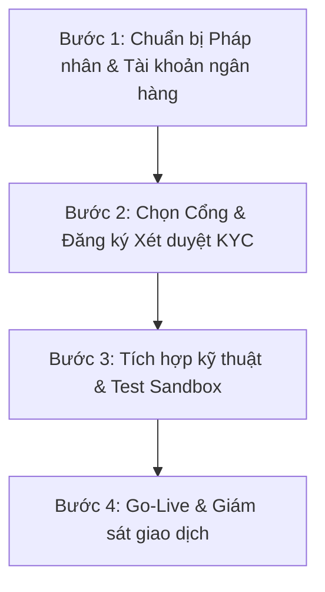
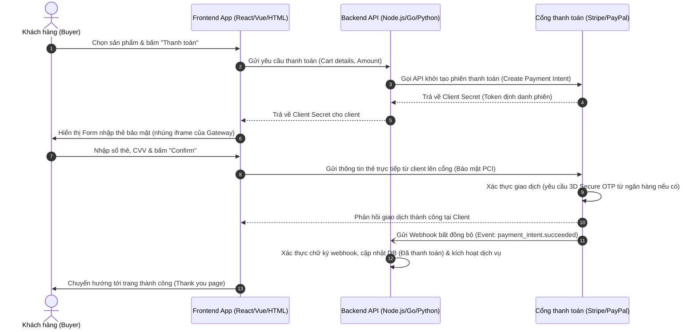

# Hướng Dẫn Tích Hợp Cổng Thanh Toán Thẻ Tín Dụng (Quốc Tế & Trong Nước)

Tài liệu này cung cấp cái nhìn toàn diện và các bước triển khai cụ thể để tích hợp cổng thanh toán thẻ tín dụng (Visa, Mastercard, JCB, v.v.) hỗ trợ cả khách hàng trong nước và quốc tế thanh toán trên website/ứng dụng của bạn.

---

## 1. So Sánh Các Giải Pháp Cổng Thanh Toán Phổ Biến

Tùy thuộc vào **loại sản phẩm/dịch vụ**, **pháp nhân doanh nghiệp** và **đối tượng khách hàng** mục tiêu, bạn có thể lựa chọn một hoặc kết hợp nhiều cổng thanh toán dưới đây:

| Tiêu chí | Stripe | PayPal | OnePay / VNPAY | Paddle / 2Checkout (MoR) |
| :--- | :--- | :--- | :--- | :--- |
| **Độ phổ biến quốc tế** | Rất cao (Tiêu chuẩn toàn cầu) | Rất cao (Khách Mỹ/Âu rất thích) | Thấp (Chỉ phục vụ khách mua hàng tại VN) | Cao (Phổ biến cho phần mềm/SaaS) |
| **Hỗ trợ pháp nhân VN** | **Không trực tiếp** (Phải qua Stripe Atlas để lập công ty Mỹ/Sing) | **Có** (Cho phép đăng ký tài khoản Business tại VN) | **Có** (Bắt buộc doanh nghiệp Việt Nam) | **Có** (Chấp nhận doanh nghiệp/cá nhân VN bán sản phẩm số) |
| **Phí giao dịch ước tính** | ~2.9% + $0.3 | ~3.49% - 4.4% + phí cố định | ~2.5% - 3.5% (Thẻ quốc tế) + phí cố định | ~4.9% + $0.5 (Paddle tự lo thuế cho bạn) |
| **Trải nghiệm người dùng** | Xuất sắc (Thanh toán trực tiếp trên trang) | Khá (Chuyển hướng hoặc mở popup PayPal) | Trung bình (Chuyển hướng sang cổng thanh toán) | Xuất sắc (Thanh toán dạng overlay popup) |
| **Loại hình phù hợp nhất** | Startup toàn cầu, SaaS, TMĐT quốc tế | Bán hàng quốc tế nói chung (Dropshipping, dịch vụ) | Bán hàng dịch vụ/du lịch/TMĐT tại Việt Nam có khách nước ngoài | SaaS, Phần mềm, Khóa học bán ra nước ngoài |

> [!NOTE]
> **Merchant of Record (MoR) là gì?**
> Các nền tảng như Paddle hay 2Checkout đóng vai trò là "Người bán trên hồ sơ". Họ sẽ thay mặt bạn thu tiền, xử lý hoàn tiền, tranh chấp và **tự động kê khai + đóng thuế (VAT/Sales Tax)** tại quốc gia của người mua. Điều này cực kỳ quan trọng khi bạn bán sản phẩm số ra nước ngoài (như Mỹ, EU) để tránh các rắc rối về luật thuế quốc tế.

---

## 2. Quy Trình Triển Khai Chi Tiết (4 Bước)



### Bước 1: Chuẩn bị Pháp nhân & Giấy tờ
* **Trong nước (VNPAY, OnePay, PayPal VN):** Bạn cần có Giấy phép đăng ký kinh doanh (GPKD) dạng Doanh nghiệp hoặc Hộ kinh doanh cá thể tại Việt Nam, kèm theo tài khoản ngân hàng đứng tên doanh nghiệp để đối soát nhận tiền (Payout).
* **Nước ngoài (Stripe trực tiếp):** Bạn cần mở công ty tại nước ngoài (thường là Mỹ - Delaware/Wyoming hoặc Singapore). Bạn có thể sử dụng dịch vụ **Stripe Atlas** (khoảng $500 chi phí thiết lập ban đầu) để thành lập doanh nghiệp Mỹ trực tuyến dễ dàng.

### Bước 2: Đăng ký & Xét duyệt (KYC)
Các cổng thanh toán sẽ kiểm duyệt website của bạn rất kỹ để phòng ngừa gian lận (Fraud) và rửa tiền. Website của bạn bắt buộc phải có:
1. **Chính sách bảo mật thông tin khách hàng (Privacy Policy).**
2. **Điều khoản sử dụng dịch vụ (Terms of Service).**
3. **Chính sách hoàn trả tiền và hủy dịch vụ (Refund & Cancellation Policy).**
4. **Thông tin liên hệ rõ ràng** (Email, hotline, địa chỉ văn phòng).
5. **Giỏ hàng và luồng thanh toán hoạt động được** (dù đang ở chế độ test).

### Bước 3: Tích hợp Kỹ thuật
Quá trình tích hợp kỹ thuật bao gồm việc xây dựng Client-side (Frontend) và Server-side (Backend) kết nối với API của cổng thanh toán.

> [!IMPORTANT]
> **Tuân thủ tiêu chuẩn bảo mật PCI-DSS:**
> **KHÔNG BAO GIỜ** được phép lưu trữ trực tiếp số thẻ (Card Number), ngày hết hạn (Expiry Date), hoặc mã bảo mật (CVV) của khách hàng vào cơ sở dữ liệu của bạn. 
> Thay vào đó, hãy sử dụng cơ chế **Tokenization** của các cổng thanh toán. Thông tin thẻ sẽ được gửi trực tiếp từ trình duyệt của khách hàng lên cổng thanh toán qua thẻ iframe bảo mật, cổng sẽ trả về một `Token` an toàn đại diện cho thẻ đó để bạn thực hiện thanh toán ở Backend.

### Bước 4: Kiểm thử (Sandbox) & Go-live
* Sử dụng thẻ test (do cổng cung cấp) để giả lập các tình huống: Thanh toán thành công, Thẻ hết hạn, Thẻ không đủ số dư, Xác thực OTP 3D-Secure thất bại.
* Cấu hình **Webhook** để cập nhật trạng thái đơn hàng bất đồng bộ khi giao dịch hoàn tất.
* Chuyển cấu hình sang môi trường Production (sử dụng Live API Keys) và thực hiện một giao dịch thật trị giá nhỏ ($1 hoặc 20,000 VNĐ) để đảm bảo dòng tiền chạy về tài khoản ngân hàng doanh nghiệp thành công.

---

## 3. Kiến Trúc Kỹ Thuật & Luồng Dữ Liệu Chuẩn

Dưới đây là sơ đồ tuần tự (Sequence Diagram) mô tả luồng thanh toán an toàn sử dụng cơ chế **Tokenization** (áp dụng cho Stripe, Braintree hoặc các cổng hiện đại):



---

## 4. Đoạn Mã Ví Dụ Tích Hợp Cơ Bản (Backend Node.js - Stripe)

Dưới đây là ví dụ minh họa cách Backend Node.js tạo một phiên thanh toán (`PaymentIntent`) gửi về cho Frontend:

```javascript
const express = require('express');
const app = express();
// Sử dụng Secret Key được cung cấp từ Stripe Dashboard (chế độ Test)
const stripe = require('stripe')(process.env.STRIPE_SECRET_KEY || 'your_stripe_secret_key_here');

app.use(express.json());

// Endpoint: Tạo phiên thanh toán
app.post('/api/checkout/create-payment-intent', async (req, res) => {
  try {
    const { amount, currency } = req.body; // amount tính bằng đơn vị nhỏ nhất (ví dụ: cents cho USD, hoặc đồng cho VND)

    // Tạo PaymentIntent trên Stripe
    const paymentIntent = await stripe.paymentIntents.create({
      amount: amount, 
      currency: currency || 'usd',
      automatic_payment_methods: {
        enabled: true, // Tự động hiển thị các phương thức thanh toán phù hợp (Card, Apple Pay, Google Pay...)
      },
    });

    // Trả client_secret về cho Frontend để hiển thị Payment Form
    res.status(200).json({
      clientSecret: paymentIntent.client_secret,
    });
  } catch (error) {
    res.status(500).json({ error: error.message });
  }
});

// Endpoint: Nhận Webhook từ Stripe khi thanh toán thành công
app.post('/api/webhook/stripe', express.raw({ type: 'application/json' }), (req, res) => {
  const sig = req.headers['stripe-signature'];
  let event;

  try {
    // Xác thực webhook được gửi từ chính Stripe chứ không phải giả mạo
    event = stripe.webhooks.constructEvent(req.body, sig, 'whsec_xxxxxxxxxxxx');
  } catch (err) {
    return res.status(400).send(`Webhook Error: ${err.message}`);
  }

  // Xử lý sự kiện thanh toán thành công
  if (event.type === 'payment_intent.succeeded') {
    const paymentIntent = event.data.object;
    console.log(`PaymentIntent for ${paymentIntent.amount} was successful!`);
    
    // TODO: Viết logic cập nhật trạng thái đơn hàng trong database của bạn tại đây
  }

  res.json({ received: true });
});

app.listen(3000, () => console.log('Server running on port 3000'));
```

---

## 5. Khuyến Nghị Lựa Chọn Tối Ưu Cho Bạn

1. **Nếu bạn là công ty Việt Nam và muốn phục vụ chủ yếu khách hàng Việt Nam + một phần khách nước ngoài đi du lịch hoặc mua sắm tại VN:**
   * Hãy liên hệ **OnePay** hoặc **VNPAY**. Họ hỗ trợ tích hợp thẻ quốc tế Visa/Mastercard rất tốt và tiền về thẳng tài khoản ngân hàng VN (VND), dễ khai báo thuế nội địa.

2. **Nếu bạn làm phần mềm, SaaS, bán sản phẩm số (eBook, Khóa học) ra thị trường Mỹ, Châu Âu, Singapore:**
   * Hãy đăng ký **Paddle** hoặc **2Checkout**. Họ sẽ lo toàn bộ thủ tục thu thuế phức tạp ở nước ngoài, giúp bạn không vi phạm luật thuế quốc tế.

3. **Nếu bạn muốn trải nghiệm thanh toán mượt mượt nhất, chuyên nghiệp nhất và sẵn sàng đầu tư lập pháp nhân nước ngoài:**
   * Hãy sử dụng **Stripe Atlas** để lập công ty tại Mỹ, sau đó mở tài khoản **Stripe Business**. Đây là hướng đi của các startup công nghệ toàn cầu.

4. **Nếu muốn tích hợp nhanh, không mất nhiều chi phí setup ban đầu và khách hàng của bạn có sẵn tài khoản PayPal:**
   * Tích hợp **PayPal Checkout** trực tiếp trên trang bằng tài khoản Business đăng ký bằng GPKD Việt Nam.
